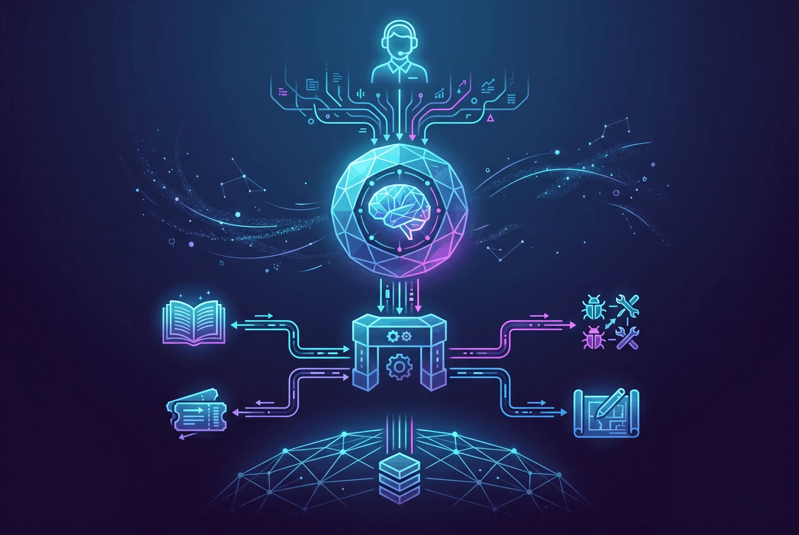

Support engineers lose time in a very specific way. A question starts in one place, the answer lives somewhere else, and before anyone notices you’ve got six tabs open and the actual problem is still half-hidden.

I wanted to fix that because I’ve lived it myself. Not with a bigger dashboard, or with another chat bubble pretending to know everything: I wanted something smaller, gentler, and more honest.

So I built an internal assistant built on Model Context Protocol that could reach into the systems we already trusted and pull back the right context when it mattered.

## The problem

On paper, the workflow looked clean enough.

1. A customer ticket lands with partial clues.
2. The engineer checks the knowledge base for known fixes.
3. They search previous tickets to see whether the issue was already solved.
4. They jump to internal docs for product behavior or edge cases.
5. They repeat the same search patterns when the first pass misses.

The problem wasn’t missing information; we had plenty of that.

The real tax was friction.

Every switch in context costs attention, and every repeated search chips away at momentum. You feel it in the middle of a live case, when the thread is still open and someone is waiting on an answer. It starts as something annoying and ends up draining more than you expect. If you’ve worked support long enough, you know the feeling immediately.

## The solution

For that, I developed an MCP server that exposes the internal search system as a set of tools a client like Claude Desktop or Claude Code can call.

The important choice was what not to build. I didn’t want a chatbot that improvises its way through everything. I wanted a thin layer that keeps the source of truth where it already lives and gives the model structured access to it. That felt calmer to me, and more respectful of the systems people already rely on every day. There’s a kind of comfort in that simplicity.

```text
Support engineer
      |
      v
Claude / AI client
      |
      v
MCP server
      |
      +--> KB search
      +--> Ticket search
      +--> Issue search
      +--> Product docs search
      |
      v
Internal search infrastructure
```

That separation mattered more than I expected. The assistant is not the database. It’s the interface, and once I started treating it that way, the shape of the whole project became clearer. I could feel the difference right away.

## Why MCP fit this use case

MCP gave me a clean boundary between the AI client and the internal services, which is exactly what I wanted: it made tool definitions explicit and search behavior easier to reason about. I could let the same backend serve different clients without hard-wiring the workflow into a single UI.

The architecture splits cleanly into three layers:

- **Client layer**: Claude Desktop or Claude Code makes tool calls over the MCP protocol. The model sees each tool's description and parameters but doesn't know about the backend.
- **MCP server layer**: A Python process that translates tool calls into HTTP requests. It handles timeouts, error messages, and response formatting. This is where the business logic lives.
- **Service layer**: The remote search infrastructure that actually runs the queries and answer generation. The server calls it over standard HTTPS but shields the client from network details.

That separation meant I could evolve the server independently from the services. If an upstream API changed, only the server needed updating. If we wanted to swap one service for another, the client didn't care.
I also liked how MCP pushed me to think in capabilities instead of prompts. A support engineer doesn’t need a giant blob of instructions that tries to anticipate every branch. They need reliable tools for lookup, comparison, and follow-up, and they need those tools to behave predictably when things are already tense. That kind of steadiness matters more than cleverness.

## Tool design

I split the server into separate tools instead of one generic search endpoint.

That sounds like a minor detail; but i assure you it isn’t, at least not when you’re trying to keep the experience understandable for the person using it. Small boundaries can make a tool feel much kinder:

1. Keyword search and semantic search solve different problems.
2. Knowledge base lookup is not the same as ticket history lookup.
3. A generated answer is not the same as a regenerated search result.
4. Narrow tools are easier to test and easier to trust.

The model can ask for the specific corpus it needs. No guessing, and no hoping one universal search call will somehow infer the right intent every single time. That restraint made the whole thing easier to trust.

### The tools

The server has several tool categories, each serving a distinct purpose.

The first handles search: semantic/neural queries across knowledge bases, tickets, issues, and documentation, paired with keyword search when you need exact phrases.

For answers, I built two tools: one to generate grounded LLM responses, another to regenerate or reformat them in different tones (formal, casual, technical, etc.).

Discovery tools let the model list available sources, tags, and sections without guessing. A fourth class handles structured metadata lookups to build more informed queries.

Each tool is stateless except for answer generation, which stores a `chat_id` so you can regenerate without re-searching. That minimal state felt right — the model can use these tools in any order, and results are cacheable.

## What the backend looked like

Under the hood, the backend wrapped a Kubernetes-deployed semantic search service that already indexed multiple corpora. My job was to make that stack usable from an AI client without leaking the messy bits or making the experience harder than it needed to be. I wanted the person on the other side to feel help, not complexity.

The practical work wasn’t glamorous:

1. Handling network access cleanly.
2. Keeping the tool surface small.
3. Returning results in a form the model could use.
4. Preserving enough metadata for a human to verify the answer.

### Implementation details

The server is a Python FastMCP application that communicates with the AI client over stdio (the MCP protocol). If you're setting this up locally, you'll add a small configuration block to your Claude Desktop config that points to your Python environment:

```json
{
  "mcpServers": {
    "kcs-search": {
      "command": "/path/to/python",
      "args": ["-m", "server_module"],
      "env": {
        "HTTP_TIMEOUT_SECONDS": "60"
      }
    }
  }
}
```

The `HTTP_TIMEOUT_SECONDS` parameter is the only tuning knob most people need to touch.

Response times vary by operation. Semantic search usually completes in 2–5 seconds. Keyword search is faster. Answer generation is slower (10–30 seconds) because it involves model inference on top of retrieval.
I also had to respect something obvious but easy to ignore: internal systems are not built for free-form AI access. Some endpoints only work in specific contexts. Some assumptions that hold locally fall apart the moment you hit the real network. You learn that quickly, usually after a few false starts. That part can be humbling.

## Security and guardrails

I found an authentication gap while working through the integration, and I documented it instead of trying to sneak around it. That part mattered to me more than the workaround would have. I’ve always preferred the slower honest path there.

That changed how I approached the rest of the implementation. Internal tools should default to the least surprising behavior:

1. Only expose what the client actually needs.
2. Avoid broad write capabilities.
3. Prefer read-only operations unless a workflow truly requires more.
4. Make the source of each result visible so the human can verify it.

For AI tooling, security isn’t a later phase. It has to be part of the interface design from the start, or the whole thing feels off. People can sense when something is missing, even if they can’t name it.

### Limitations and caveats

A few hard constraints shaped this tool:

- **Network access**: The upstream services are only reachable from inside the internal network. The server returns a connection error if network access is not configured correctly.
- **Authentication**: At the time of building this, the upstream services had no authentication layer. This means the server should never run on shared or public machines. It's designed for individual developer workstations only.
- **Environment scope**: Both services run on staging infrastructure. There is no production endpoint at this point.
- **Streaming**: The underlying answer generation API supports streaming, but v1 of this server does not. Answer generation returns the full response when complete instead of streaming tokens as they arrive. This adds latency but simplifies the client implementation.

These constraints shaped the tool's scope on purpose. It works well for solo developers on internal networks with staging data. I didn't try to make it something it isn't — that simplicity is the whole point. There's less to go wrong when a tool admits what it can't do.

## Adoption

The strongest sign that the project was useful wasn’t the code. It was that I shared it with other engineers on the team.

That changes the bar immediately. A private prototype can be clever and still be useless. A shared internal tool has to survive real usage, inconsistent questions, and the pressure of helping someone in the middle of a live support case. That’s a different kind of test entirely, and it asks for a different kind of care.

Once other engineers could use it, the project had to be understandable, dependable, and fast enough to stay out of the way. If it gets in the way, people stop trusting it, and trust is the whole game here. I felt that responsibility pretty strongly.

## What I learned

This project taught me a few things that go beyond one internal assistant.

1. AI tooling becomes much more useful when it is attached to real operational systems.
2. Retrieval quality matters more than flashy prompting.
3. Narrow, explicit tools are easier to trust than one large abstraction.
4. Production constraints shape the product as much as model choice does.
5. The best AI systems for support work are the ones that reduce context switching.

It also reinforced something I’ve seen over and over in support and infrastructure work: reliability is a feature. If the tool only looks good in demos, people will leave it behind, no matter how clever it seemed at first. Real usefulness is quieter than that.

## Closing thought

I like building AI systems that make expert work feel lighter instead of replacing the expert. This project did that in a very concrete way. It turned scattered knowledge into something engineers could query directly, right in the flow of work, which is exactly the kind of thing I want to keep building. That kind of work feels good to me.

That’s the kind of AI product I want to keep building.

---

## Related Project

[**dubweave** — Fully local AI dubbing pipeline](../projects/dubweave.md). Like this KCS Search MCP project, dubweave is built on the principle of keeping everything local, measurable, and under your control. Both are systems that respect the data they handle and the people who use them.
